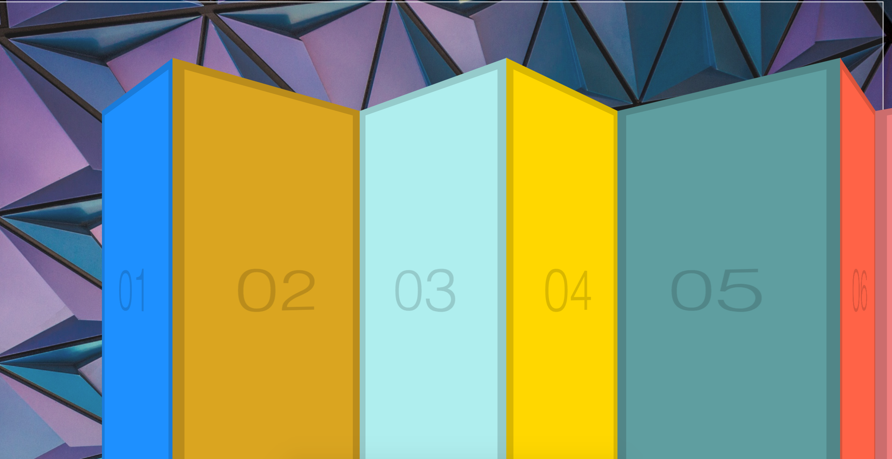

> This is a JavaScript practice with [JavaScript30](https://javascript30.com/) by [Wes Bos](https://github.com/wesbos) without any frameworks, no compilers, no boilerplate, and no libraries.

# 27 - Click and Drag to Scroll



view demo [here](https://amelieyeh.github.io/JS30/26-Stripe%20Follow%20Along%20Nav/index.html)

### Define variables we need

```
const slider = document.querySelector('.items');
let isDown = false;
let startX;
let scrollLeft;
```

- `isDown`: mouse is clicked down or not
- `startX`: start point from the slider
- `scrollLeft`: store slider's scrollLeft when scroll occured

### The `mousedown()` function

1. set the `isDown` is `true`
2. add `active` class to the `slider`
3. get the start point when mousedown
4. get the previous `scrollLeft` if scrolled

```
slider.addEventListener('mousedown', (e) => {
  isDown = true;
  slider.classList.add('active');
  startX = e.pageX - slider.offsetLeft;
  scrollLeft = slider.scrollLeft;
});
```

- `isDown`: set `true` when mouse down
- `startX = e.pageX - slider.offsetLeft;`: prevent the initial start point of slider isn't start from 0 (`offsetLeft`) of page (maybe there is padding or margin around the slider), so we need to subtract the value of `slider.offsetLeft` to get the real point of position

### The `mouseleave()` function

1. set `isDown` back to `false`
2. remove the `active` classList

```
slider.addEventListener('mouseleave', () => {
  isDown = false;
  slider.classList.remove('active');
});
```

### The `mouseup()` function

1. set `isDown` back to `false`
2. remove the `active` classList

same as `mouseleave()`

```
slider.addEventListener('mouseup', () => {
  isDown = false;
  slider.classList.remove('active');
});
```

### The `mousemove()` function

the important part

```
slider.addEventListener('mousemove', (e) => {
  if(!isDown) return;
  e.preventDefault();
  const x = e.pageX - slider.offsetLeft;
  const walk = (x - startX) * 3;
  // slider.scrollLeft = walk;
  slider.scrollLeft = scrollLeft - walk;
```

- `if(!isDown) return;`: stop the function from running if not mouse down
- `e.preventDefault();`: stop the browser think that we might want to select text

small details:

- `const walk = (x - startX) * 3;`: how far we deviated from the initial point, and add with `* 3` (px) to make slider scroll smoothly

```
  // slider.scrollLeft = walk;
  slider.scrollLeft = scrollLeft - walk;
```

`slider.scrollLeft = walk;` seems work but still jumpy, so recalculating like
`slider.scrollLeft = scrollLeft -walk;` every single time can fix this jumpy.

